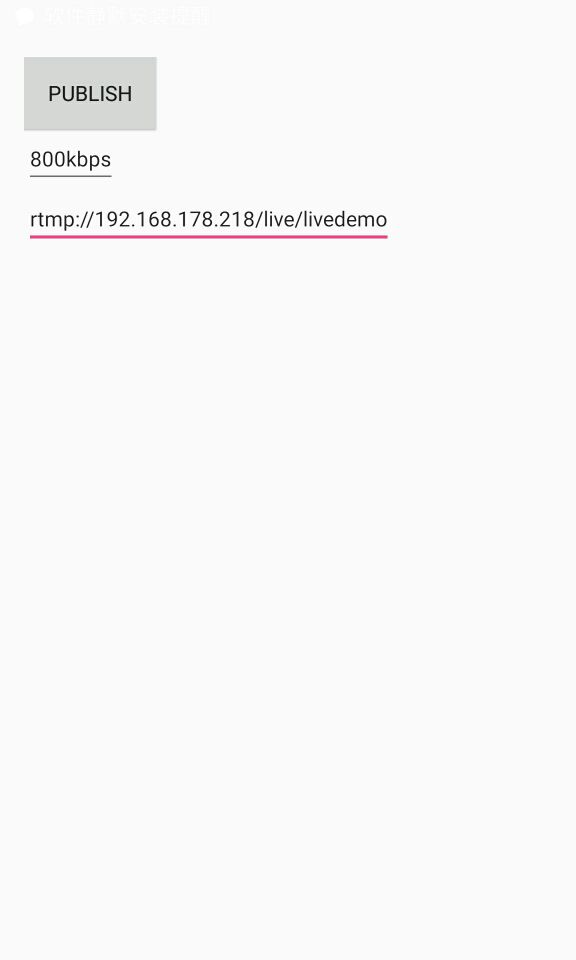
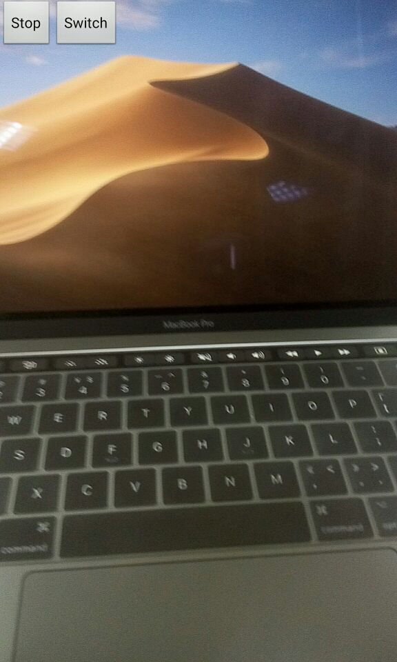

# SimpleLivePublisher.Lite
### 简介-Introduction

Simple Live Publisher 是简洁的 Android 平台直播推流Lite SDK，H264 和 AAC的编码使用的是Android的mediacodec, 网络部分Java重写了RTMP协议，方便阅读定位，YUV处理考虑性能采用了LibYUV。延时在1-3秒左右。

A simple live publisher for android, H264 and AAC encoder use android mediacodec. Publish media stream over RTMP protocol.  Using LibYUV for process yuv.

### 特点-Feature

* 支持 H.264/AAC 硬编码 -Supporting H264/AAC hard encoding
* 支持RTMP协议推流 -Supporting publishing media over RTMP
* 支持重力感应旋转画面-Supporting  dynamic rotation  image
* 支持前后置摄像头动态切换，自动对焦-Supporting  front/back camera dynamic swithing and autofocus

### Todo List

- [ ] 帧率有时不太稳定

### 性能-Performance

Simple Live Publisher 推720P视频，魅族MX4(14年32bit手机)上测试，CPU 占用在7%-12%左右，三星note4上测试，CPU占用7%左右，近两年出的手机CPU占用都在7%左右，发热控制的较好。

Simple Live Publisher Publish 720P video，in Meizu MX4(2014-32bit-mobile)，cpu use about 7%-12%，in Samsung note4  about 7%，heating control well.

魅族-MX4 Mobie CPU Usage：

网络和内存-Net & Mem Usage:

### DEMO

