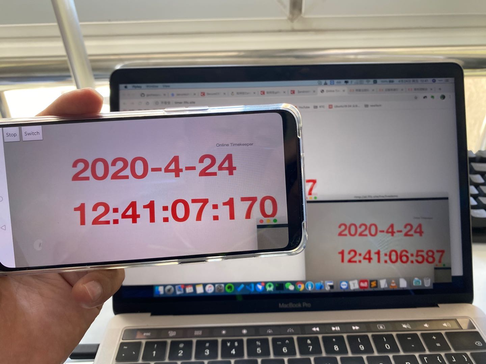
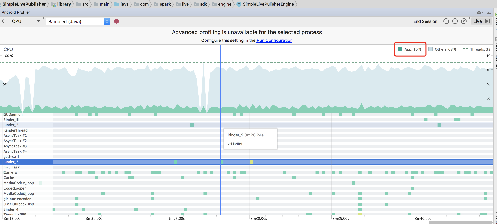

## Rtmp Publish Kit for Android
### 简介

Rtmp Live Publish Kit 是简洁的 Android 平台直播推流SDK，使用 Mediacodec进行H264 和 AAC 编码, 网络部分 Java 重写了RTMP协议，方便阅读定位，YUV处理考虑性能采用了LibYUV。整体延时在1-3秒左右。

A simple rtmp live publisher for android, H264 and AAC encoder use android mediacodec. Publish media stream over RTMP protocol.  Using LibYUV for process yuv.

### 特性

* 支持 H.264/AAC 硬编码 -Supporting H264/AAC hard encoding
* 支持RTMP协议推流 -Supporting publishing media over RTMP
* 支持重力感应旋转画面-Supporting  dynamic rotation  image
* 支持前后置摄像头动态切换，自动对焦-Supporting  front/back camera dynamic swithing and autofocus

### NDK配置

项目依赖NDK，已在build.gradle中指定21版本ndk, 可以不动，也可以按需要版本修改

```shell
ndkVersion '21.4.7075529'
```

### 权限

需要相机和麦克风权限，demo比较简单，默认不会主动申请，需要手动在app权限里面开启，

若遇到预览黑屏或者无声音问题，检测是否开启相机和麦克风权限。

### Demo

北京向阿里香港服务器推流效果：



### 性能-Performance

Simple Live Publisher 推720P视频，魅族MX4(14年32bit手机)上测试，CPU 占用在7%-12%左右，三星note4上测试，CPU占用7%左右，近两年出的手机CPU占用都在7%左右，发热控制的较好。

Simple Live Publisher Publish 720P video，in Meizu MX4(2014-32bit-mobile)，cpu use about 7%-12%，in Samsung note4  about 7%，heating control well.

魅族-MX4(2014-12) Mobie CPU Usage：




网络和内存-Network & Memory Usage:


